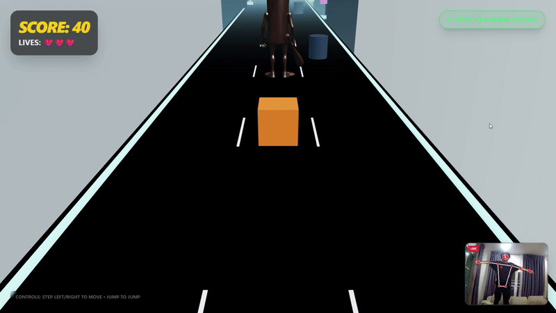
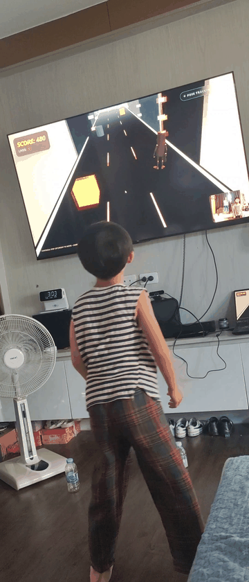
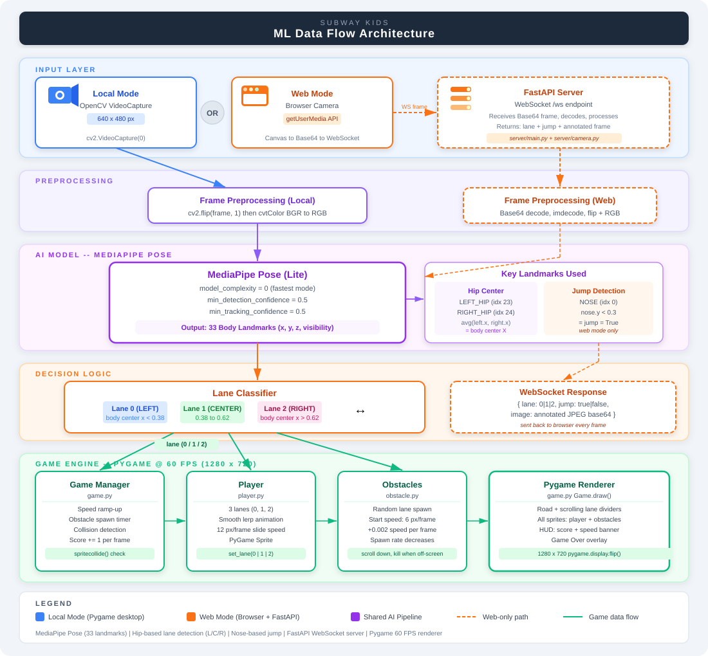

# Subway Kids

A **Subway Surfers**-style game controlled by your **body movements** via webcam — powered by **MediaPipe Pose** AI.

---

## Demo





---

## ML Data Flow Architecture



---

## How It Works

| Step | Component | Detail |
|---|---|---|
| 1 | **Webcam / Browser Camera** | Captures live video frames |
| 2 | **Frame Preprocessing** | Mirror flip + BGR to RGB conversion |
| 3 | **MediaPipe Pose (Lite)** | Detects 33 body landmarks per frame |
| 4 | **Hip Center Calculation** | Averages LEFT_HIP (23) + RIGHT_HIP (24) x-coords |
| 5 | **Lane Classifier** | body center x < 0.38 = Left, 0.38-0.62 = Center, > 0.62 = Right |
| 6 | **Game Engine** | Player slides to target lane, obstacles scroll down at increasing speed |

### Two Deployment Modes

**Local Mode** — runs entirely on desktop with Pygame:
```
Webcam (OpenCV) -> MediaPipe Pose -> Lane -> Pygame
```

**Web Mode** — browser sends frames to a FastAPI server via WebSocket:
```
Browser Camera -> WebSocket -> FastAPI Server -> MediaPipe Pose -> lane + jump -> Browser Game
```

---

## Controls

| Method | Action |
|---|---|
| Body lean left | Move to Lane 0 (Left) |
| Body center | Stay in Lane 1 (Center) |
| Body lean right | Move to Lane 2 (Right) |
| Jump (nose.y < 0.3) | Jump — web mode only |
| Arrow keys | Keyboard fallback |
| `R` | Restart after game over |
| `F` | Toggle fullscreen |
| `ESC` / `Q` | Quit |

---

## Tech Stack

| Layer | Technology |
|---|---|
| Pose Detection | MediaPipe Pose (model_complexity=0, Lite) |
| Computer Vision | OpenCV (cv2) |
| Game Engine | Pygame @ 60 FPS, 1280x720 |
| Web Server | FastAPI + WebSocket |
| Language | Python 3 |

## Installation

```bash
pip install -r requirements.txt
python main.py
```

### Web Mode
```bash
cd server
pip install -r requirements.txt
uvicorn main:app --reload
```
